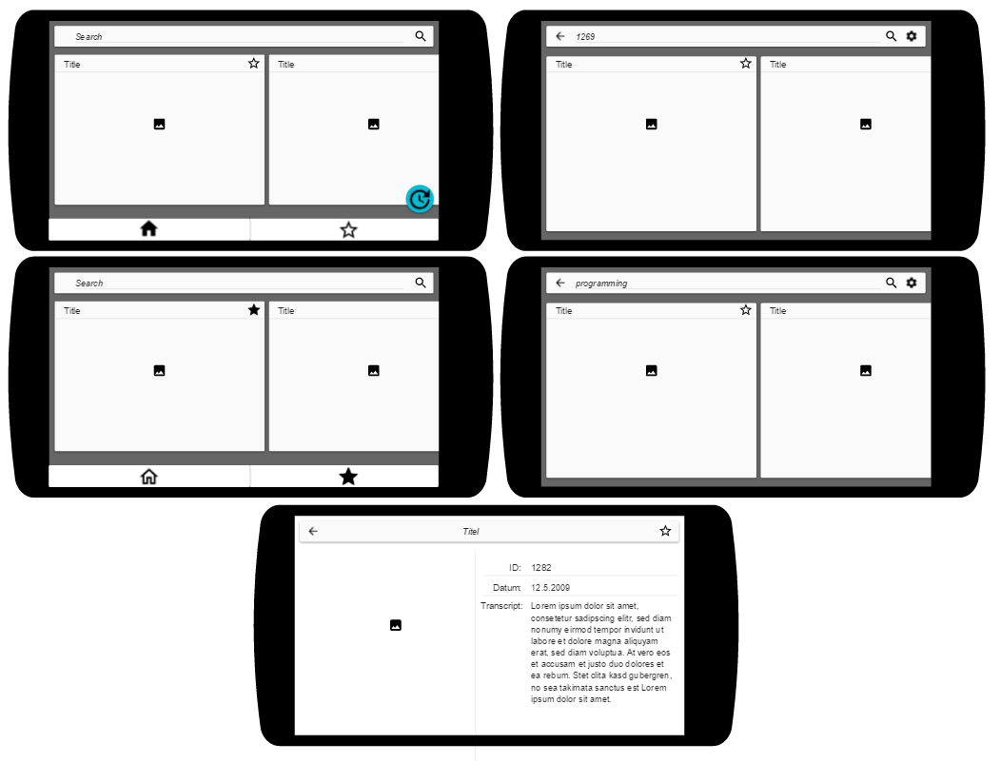

XKCD Comic App
==============

Zweck
-----

Ueber diese Applikation koennen diverse Comics von der xkcd Webseite eingesehen werden. Es kann auch nach Comics mit der ID und Schlagwoertern gesucht werden. Sobald ein Comic gefunden wurde, welches einem besonders gefaellt, kann man es favorisieren und somit speichern.

API
---

Wir haben uns fuer die XKCD API entschieden, da diese sehr simpel und ein guter Start ist, wenn wir uns mehr auf das Design der Applikation als die API konzentrieren wollen.

Die [Dokumentation dieser API](https://xkcd.com/json.html) ist sehr simpel da nur 2 Endpunkte zur Verfuegung stehen.

### Neustes Comic - Endpoint

Um das letzt veröffentlichte Comic zu erhalten, sendet man ein Request über folgende URL: https://xkcd.com/info.0.json.

Von dieser URL wird dann folgende Rueckgabe erwartet.

```json
{
    "month": {int},
    "num": {int},
    "year": {int},
    "safe_title": {str},
    "transcript": {str},
    "alt": {str},
    "img": {str},
    "title": {str},
    "day": {int}
}
```

### Comic nach ID - Endpoint

Um ein Comic nach ID zu erhalten, sendet man eine Abfrage über folgende URL, welche die ID beinhaltet: https://xkcd.com/{int}/info.0.json

Von dieser URL wird dann folgende Rueckgabe erwartet.

```json
{
    "month": {int},
    "num": {int},
    "year": {int},
    "safe_title": {str},
    "transcript": {str},
    "alt": {str},
    "img": {str},
    "title": {str},
    "day": {int}
}
```

Anwendungsfälle
---------------

| ID | Titel                        | Beschreibung                                                                                                                                                                                                                                                                                                      | Prioritaet | Vorbedingungen                                       | Schritte                                                                                  | Nachbedingungen                                                                                                         |
|----|------------------------------|-------------------------------------------------------------------------------------------------------------------------------------------------------------------------------------------------------------------------------------------------------------------------------------------------------------------|------------|------------------------------------------------------|-------------------------------------------------------------------------------------------|-------------------------------------------------------------------------------------------------------------------------|
| 01 | Neuestes Comic               | Das neueste Comic wird auf der homepage dargestellt sobald die Applikation geoeffnet wird.                                                                                                                                                                                                                        | 0          | - App ist geoeffnet                                  |                                                                                           | Das neueste Comic ist im ersten Kartenelement der Startseite dargestellt.                                               |
| 02 | Zufaelliges Comic            | Ein zufaelliges Comic wird auf der Startseit dargestellt sobald die Applikation geoeffnet wird.                                                                                                                                                                                                                   | 0          | - App ist goeffnet                                   |                                                                                           | Ein zuefaelliges Comic ist im ersten Kartenelement der Startseite angezeigt.                                            |
| 03 | Aktualisieren der Startseite | Bei Betaetigung der Reload-Taste erneuert sich das neueste Comic falls eine neue Ausgabe erhaetlich ist, und es wird ein neues zufaelliges Comic geladen.                                                                                                                                                         | 0          | - App ist geoeffnet                                  | - Der Benutzer tippt die Reload-Taste an                                                  | Das neueste Comic ist im ersten Kartenelement der Startseite dargestellt und ein neues zufaelliges Comic wurde geladen. |
| 04 | Suche mit ID                 | Wenn der Inhalt des Suchfeldes bei einer Suche eine einfache Ganzzahl ist, soll das erste Element das Comic mit der entsprechenden ID darstellen, solange dieses existiert. Nach dem ersten Element werden die Comics angezeigt welche in den `transcript`, `title` und `alt` Feldern den Suchbegriff beinhalten. | 0          | - App ist goeffnet                                   | - Der Benutzer sucht mit einer einfachen Ganzzahl ohne Vorzeichen, unter dem Wert `2147`. | Die Comics werden wie beschrieben dargestellt.                                                                          |
| 05 | Suche nach Erscheinungsdatum | Wird ein Datum als Suchbegriff verwendet, werden die Comics nach Erscheinungsdatum angezeigt.                                                                                                                                                                                                                     | 4          | - App ist geoeffnet                                  | - Benutzer sucht mit einem Datum                                                          | Falls ein Comic am angegebenen Datum erschienen ist, wird dieses angezeigt.                                             |
| 06 | Suche mit Suchbegriff        | Wenn der Inhalt des Suchfeldes bei einer Suche keine einfache Ganzzahl ist, sollen die Elemente welche den Suchbegriff in in den Feldern `transcript`, `title` und `alt` beinhalten.                                                                                                                              | 1          | - App ist goeffnet                                   | Der Benutzer sucht mit einem Begriff welcher keine Zahl ist                               | Die Comics werden wie beschrieben dargestellt.                                                                          |
| 07 | Favorisieren von Comics      | Wenn auf das Stern Symbol eines Comics getippt wird, wird das Comic zu den Favoriten hinzugefuegt und das Stern Symbol aendert sich so, dass erkennbar ist, dass das Comic favorisiert ist.                                                                                                                       | 0          | - App ist geoeffnet                                  | - Der Benutzer tippt auf das Stern Symbol eines Comics                                    | Der Ablauf wickelt sich ab wie beschrieben.                                                                             |
| 08 | Einsehen der Favoriten       | Die favorisierten Comics koennen unter den Favoriten eingesehen werden.                                                                                                                                                                                                                                           | 0          | - App ist geoeffnet<br>- Der Favoriten-Tab ist offen |                                                                                           | Alle favorisierten Comics werden angezeigt.                                                                             |
| 09 | Detailansicht eines Comics   | Die Details, welche den Titel, das Transkript, den Alt Text und das Erscheinungsdatum angeben, koennen eingesehen werden.                                                                                                                                                                                         | 1          | - App ist geoeffnet                                  | - Der Benutzer tippt auf ein Comic                                                        | Die Detailansicht mit allen Feldern wird angezeigt.                                                                     |
| 10 | Suche personalisieren        | Es kann bestimmt werden, in welchen Feldern (`transcript`, `title` und `alt`) der Suchbegriff gesucht wird.                                                                                                                                                                                                       | 3          | - App ist geoffnet                                   | - Der Benutzer tippt auf den Pfeil links von der Suchleiste.                              | Es oeffnet sich ein Menue in dem er bestimmen kann in welchen Feldern der Comics er suchen will.                        |

### Prioritätenlegende

-	0 = kritisch
-	1 = wichtig
-	2 = optional
-	3 = nett zum haben

Mockups
-------

Die folgenden Mockups stellen unser vorgesehenes Design dar.

### Portrait


### Landscape



### Flow


Tägliches Journal
-----------------

Die folgenden Paragrafen beschreiben die Arbeit, welche waehrend dem Projekt geleistet wurde.

### Daniela Simões

| Datum     | Aktivitäten                                      | Kommentar                                                                                                                                                                                                     |
|-----------|--------------------------------------------------|---------------------------------------------------------------------------------------------------------------------------------------------------------------------------------------------------------------|
| 8.5.2019  | - Brainstorming<br>- Präsentation angefangen<br> | Nachdem die Grundideen des Programms sowie Skizzen der verschiedenen Seiten definiert wurden, fing ich mit der Präsentation an. Momentant ist Zeit mein letztes Problem und die Projektarbeit geht gut voran. |
| 9.5.2019  | - Dokumentation<br>- Präsentation<br>- Template für ListView cards | Der schwierigste Teil der ListView ist, die Cards dynamisch zu listen, aber da uns ein Beispielprojekt zur Verfügung gestellt wurde, kann ich mich nach dem orientieren. |
| 10.5.2019 | - Template für ListView cards<br>- Searchbar<br>- Search Funktion | Da ich mit Testdaten arbeiten musste, konnte ich die Templates für die Card Elemente noch nicht sicher erstellen, aber das erstellen der Cards und diese in die ListView zu listen vollendete ich schnell und problemlos. |
| 15.5.2019 | - Fixed ImageView in cards<br>- OnClickListener für card Elemente<br>- OnClickListener für reload Knopf<br>- Filter Dialog für Search| Für den OnClickListener bei den Cards war es etwas schwierig diesen richtig zu implementieren, sodass er auch funktioniert. Mit etwas hilfe habe ich es dann auch geschafft und konnte die Cards und Reload etwas verbessern und am Suchfilter Dialog anfangen. |
| 16.5.2019 | - Filter Dialog für Search<br>- Cards vollenden<br>- Favorite Funktion | Der Dialog für die Suchfilter dauerte ziemlich lange zu implementieren da immer von irgendwo ein NullPointerException aufgerufen wurde. Schlussendlich entschieden wir uns diese Funktion für's erste zu Vernachlässigen wegen der Zeit. |

### Dylan Schmid

| Datum     | Aktivitäten       | Kommentar      |
|-----------|-------------------|----------------|
| 8.5.2019  | - Mockup und App besprochen<br>- b<br>- c | Wir besprachen im Team die Einzelheiten für unsere App. |
| 9.5.2019  | - Workflow erstellt<br>- letzt Mockupänderungen<br>- OnItemClickListener für ListView<br> | Mockups fertiggestellt und mit dem OnItemClickListener begonnen, damit wir die DetailView öffnen können. |
| 10.5.2019 | - OnItemClickListener<br> | Mit vielen Versuchen den OnItemClickListener schlussendlich zum funktionieren gebracht. |
| 15.5.2019 | - DetailView Intent<br>- DetailView layout <br> | Den Intent denn wir der DetailActivity mitgeben musste als StringArrayList übergeben werden. Dafür musste ich das Comic zu Strings umwandeln und diese einer ArrayList hinzufügen. |
| 16.5.2019 | - Layout fertiggestellt<br>- Intent ausgepackt und in Layout übergeben<br>- c | Projekt grösstenteils fertiggestellt. Der Intent musste ausgepackt und in die richtigen Views übergeben werden. Zu Schluss passte ich die Darstellung im GUI noch an. |

### Lani Wagner

| Datum     | Aktivitäten                                                                                         | Kommentar                                                                                                                                                            |
|-----------|-----------------------------------------------------------------------------------------------------|----------------------------------------------------------------------------------------------------------------------------------------------------------------------|
| 8.5.2019  | - App Design Diskussion<br>- Use Cases schreiben                                                    | Wir konnten heute noch nicht viel machen da uns nur eine halbe Stunde zur Verfuegung stand, aber ich denke, dass wir in den folgenden Tagen gut voran kommen werden. |
| 9.5.2019  | - Grundstruktur der Dokumentation aufstellen<br>- Use Cases schreiben<br>- Basisnavigation einbauen | Wir haben am Morgen viel zu viel Zeit damit vertan die Use Cases und Dokumentation zu schreiben und sind etwas weiter hinten als ich gehofft haette.                 |
| 10.5.2019 | - API calls definieren<br>- Aktionknopf einfuegen<br>- Anzeige des neuesten und zufaelligen Comics mit Bild implementieren | Heute konnte ich endlich etwas sichtbar praktisches implementieren. Ich schaffte es eben das neueste und zufaellige Comic anzuzeigen. |
| 15.5.2019 | - Anzeige der Favoriten implementieren<br>- Persistierung aller Comics hinzufuegen | Nun werden beim Start der Applikation alle Comics reingeladen und die Comics welche als favorisiert abgespeichert sind, werden als solche im Favoriten Tag abgebildet. |
| 16.5.2019 | - a<br>- b<br>- c | Lorem ipsum... |
| 17.5.2019 | - | Lorem ipsum... |

Reflexion
---------

### Daniela Simões

Der Einstieg in Android Studio verlief problemlos und ich konnte gut an meine ersten Aufgaben arbeiten. Da meine Emulatoren keine Internetverbindung aufbauen konnten musste ich meine Funktionen mit eigenen Testdaten testen und später, wo die API Calls funktionierten und die Testdaten rausgenommen wurden, bei jemand anderem. Die Kommunikation im Team empfand ich als gut und angenehm, sodass beim Planen immer alle involviert wurden und auf eine Lösung geeinigt werden konnte. 
Der Dialog für die Suchfilter bereitete mir am meisten Schwierigkeit. Dieser löste ständig einen NullPointerException aus und kostete schlussendlich viel Zeit. Es wurde dann entschieden, den Dialog für die Suchfilter auszulassen da die Zeit knapp wurde und es noch wichtigere Sachen gab, die zu erledigen waren.
Zu Schluss vollendete ich noch ein paar angefangene Funktionen, fügte neue kleine hinzu, welche ich rasch beenden konnte.

### Dylan Schmid
Für mich war der üK zum Teil Wiederholung, vorallem bei der Theorie gab es ein paar Themen die ich schon kannte. Es war jedoch trotzdem gut einen Refresher zu haben. Android Studio war mir auch schon bekannt, ich hatte bei den Vorbereitungen aber probleme mit dem Git Repo. Der OnItemClickListener bereitete mir ein paar Verständnissprobleme und hinderte mich daran so bald wie möglich mit der DetailView weiter zu machen.
Der Intent war eindeutig einfacher als der ClickListener, nur wie man die Daten im Intent mitgibt war unverständlich. Im Layout für die DetailView konnte ich alle Daten darstellen, auch das Image das mit Picasso geholt werden musste, nur die Möglichkeit das Comic zu favorisieren musste ich aus Zeitgründen weg lassen.
Im Ganzen verlief die Arbeit gut, auch als Team hat es gut funktioniert.

### Lani Wagner
